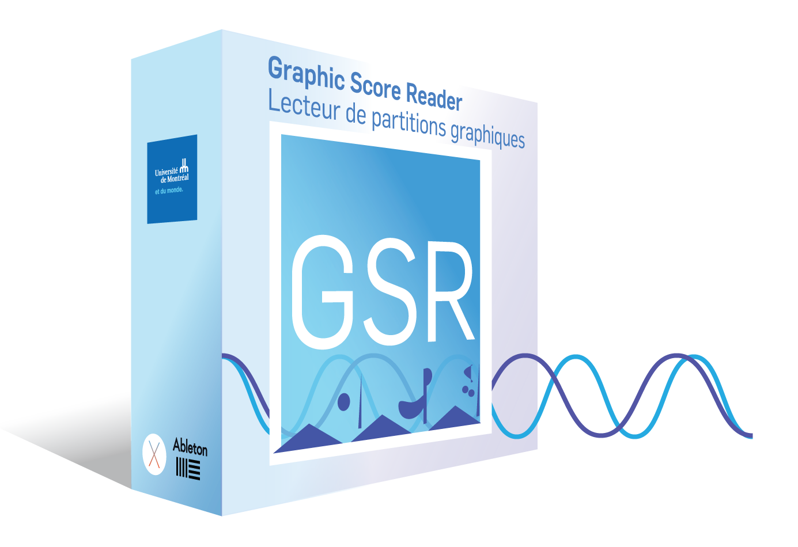

# Graphic Score Reader

Developed by [Le Laboratoire formes•ondes (LFO)](https://lfo-lab.ca/) (programming: Evan Montpellier), **GSR** is a macOS Max for Live device for real-time scrolling of graphical score files, allowing score playback to be combined with the audio and MIDI features of Ableton Live.

---

Outils développé par [Le Laboratoire formes•ondes (LFO)](https://lfo-lab.ca/) (programmation: Evan Montpellier), **GSR** est un plugiciel macOS Max for Live de lecture en temps réel de partitions graphiques, permettant de combiner la lecture à la puissance des fonctionnalités audio et MIDI du logiciel Ableton Live.

## Releases

GSR is currently **beta software**, and should only be used in production scenarios with caution. Please report all bugs using the issue tracker.

The latest release can be found [here](https://github.com/evanmtp/graphicscorereader/releases/tag/1.2.0).

---

GSR est actuellement **bêta**, et ne doit être utilisé dans des scénarios de production qu’avec prudence. S'il vous plaît signaler tous les bugs en utilisant le suivi des problèmes.

La dernière version peut être trouvée [ici](https://github.com/evanmtp/graphicscorereader/releases/tag/1.2.0).

## System and Software Requirements / Exigences système et logiciel

Tested on Mac OS X Sierra running Ableton Live 9.9.7.

On Live 10, please use **Max 8.0.3 or higher** as there are bugs related to Max 8.0.0. On Live 9, please use Max 7.3.5 or 7.3.6.

**IMPORTANT NOTICE:**
In both cases, please make sure to set Live to use an external Max application rather than the bundled version of Max. You can change this setting in Live via Preferences -> File Folder -> Max Application. The appropriate versions of Max can be downloaded from [cycling74.com](https://cycling74.com).

---

Testé sur Mac OS X Sierra avec Ableton Live 9.9.7.

Sur Live 10, utiliser **Max 8.0.3 ou plus récent** pour éviter des bogues reliés à Max 8.0.0. Sur Live 9, utiliser Max 7.3.5 ou 7.3.6.

**AVIS IMPORTANT:**
Il est important de s’assurer que Live utilise une application Max externe plutôt que la version par défaut via Préférences -> Fichier -> Application Max. La bonne version de Max peut être téléchargée sur [cycling74.com](https://cycling74.com).

## Documentation

- [English documentation](https://github.com/evanmtp/graphicscorereader/raw/master/docs/GSR_120_documentation-EN.pdf)
- [Documentation française](https://github.com/evanmtp/graphicscorereader/raw/master/docs/GSR_120_documentation-FR.pdf)